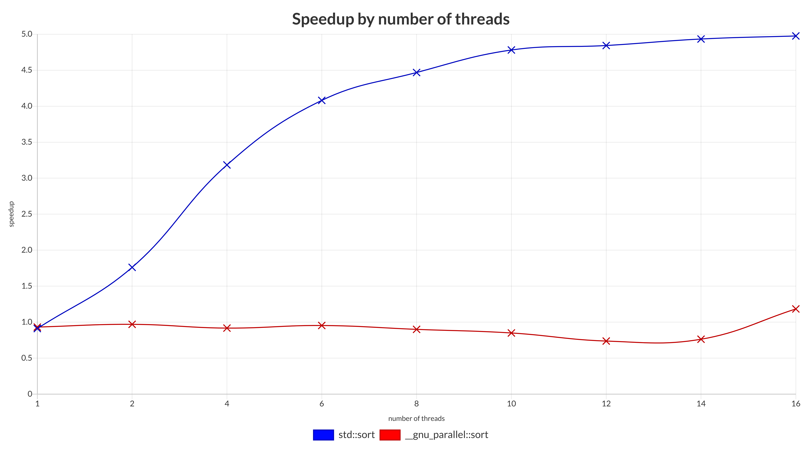
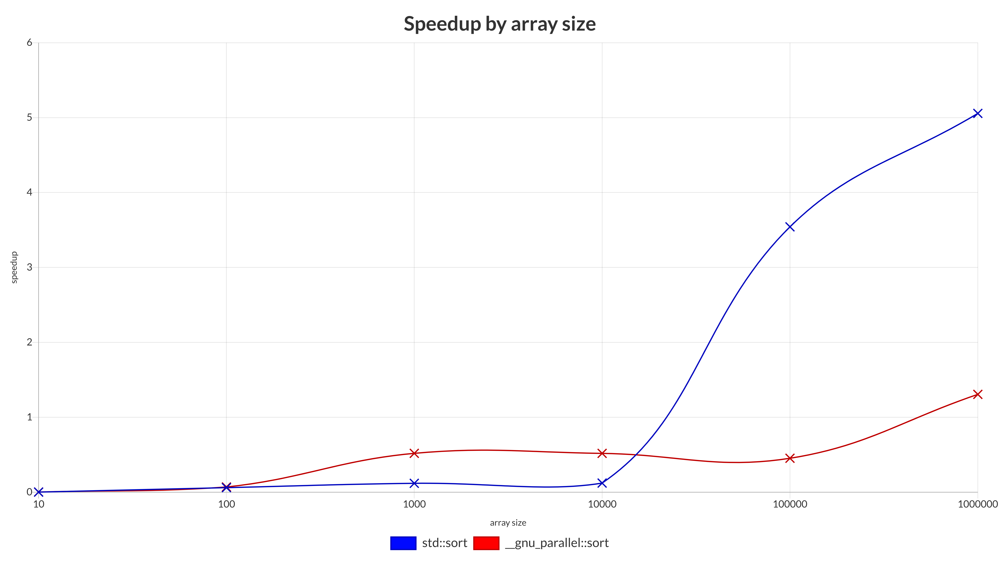

# Topic 

Benchmark `min_max_quicksort` against `std::sort` and
`__gnu_parallel::sort`

## Environment

- OS: Ubuntu 23.10
- RAM: 16GB
- CPU: AMD Ryzen 7 5800H with Radeon Graphics × 16
- Compiler: g++

Compiler-Command:
```bash
g++ -fopenmp -Ofast -std=c++11 -march=native min_max_quicksort.cpp -o min_max_quicksort
```

## Speedup by number of threads



## Speedup by array size



## Trends

- there is no noticable difference between `__gnu_parallel::sort` and `min_max_quicksort`, because both are multi-threaded algorithms

- if there's a small number of threads, no significant speedup can be observed <br>
**potential reason:** <br>
if there's e.g.: only one thread, parallel algorithms have to work like sequential algorithms

- if there's an array with just a few elements, no significant speedup can be observed <br>
**potential reason:** <br>
the nessecary computing time to sort just a few elements is too low to make any use of the multi-threaded approaches

- speedup against `std::sort` in the first graph approaches approximately 5 and looks like a square root function

- `std::sort` works fine for array sizes up until 10.000, for bigger arrays a mulit-threaded approach is recommended