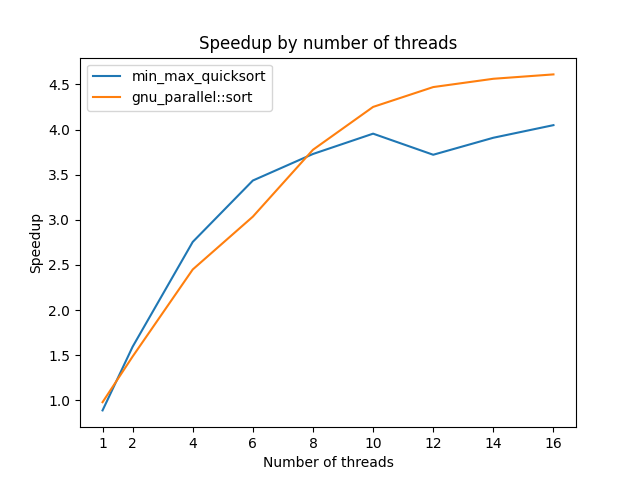

# Topic 

Benchmark `min_max_quicksort` against `std::sort` and
`__gnu_parallel::sort`

## Environment

- OS: Ubuntu 23.10
- RAM: 16GB
- CPU: AMD Ryzen 7 5800H with Radeon Graphics × 16
- Compiler: g++

Compiler-Command:
```bash
g++ -fopenmp -Ofast -std=c++11 -march=native min_max_quicksort.cpp -o min_max_quicksort
```

## Speedup by number of threads



## Speedup by array size


## Trends

- there is only a slight difference between `__gnu_parallel::sort` and `min_max_quicksort` for the speedup by number of threads, because both are multi-threaded algorithms

- if there's a small number of threads, no significant speedup can be observed. For 4 to 8 threads, it looks like `min_max_quicksort` has better performance and for more then 8 threads, `__gnu_parallel::sort` has better performance. <br>
**potential reason:** <br>
if there's e.g.: only one thread, parallel algorithms have to work like sequential algorithms

- if there's an array with just a few elements (array size less then 10000), no significant speedup can be observed <br>
**potential reason:** <br>
the nessecary computing time to sort just a few elements is too low to make any use of the multi-threaded approaches

- the graphs for the speedup by number of threads look like square root functions, so the speedup with more threads will be diminished

- `min_max_quicksort` has a similar performance like `__gnu_parallel::sort` for array sizes up until 10.000, for bigger arrays `__gnu_parallel::sort` outperforms