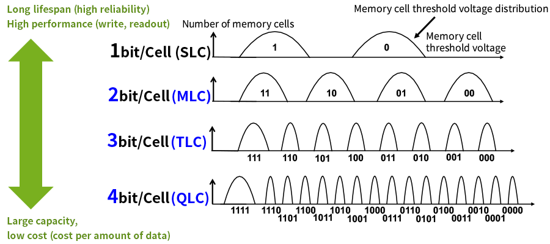

# Topic

SSD Cells

## Difference between SLC, MLC, TLC and QLC

Like the name suggests, SLC can store one bit per in each cell, while the MLC (2), TLC (3) and QLC (4) can store more bits in each cell.
Because of that, a SLC has a higher read- and write-power and is less errorprone, because if one bit needs to be read, it only has to access the cell where the bit is stored, while e.g. in MLCs, if only one bit of the cell is needed, the other one is read as well, which has a bad impact on the lifetime on the MLCs.

## Price difference between the cell-types

What i found interesting is, that SLCs are much more expensive as MLCs, TLCs and QLCs. Because if one wants to create a SSD, one will need more SLCs to have the same amount of storage as e.g. MLCs, because the SLC can only store one bit. Because of this, more SLCs are build into the SSD and the price increases. 

## Visual Overview

Additionally i found this image [here](https://www.kioxia.com/en-jp/rd/technology/multi-level-cell.html) while searching for SLCs, which i find quite good as an overview:
