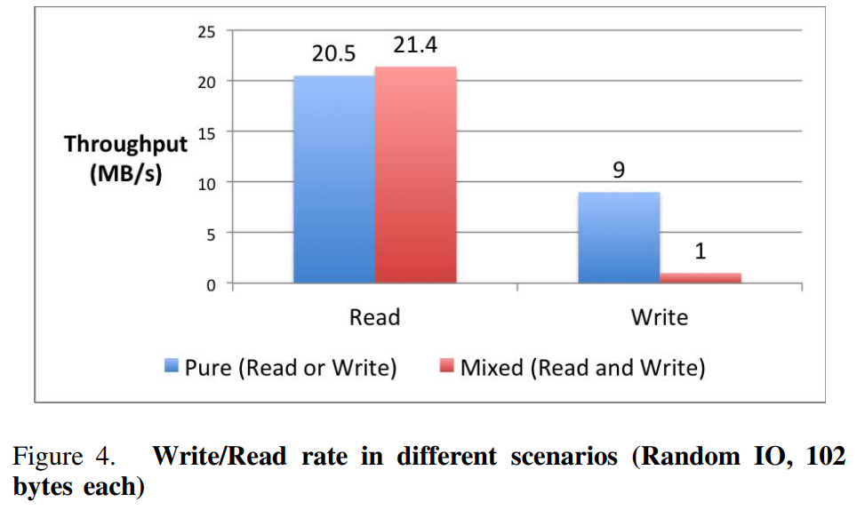

# Paper 

Discuss two things you find particularly interesting.

## Discussion 1

### Topic

SSD-friendly application design

### Discussion

I found it quite interesting, what goals the paper tries to solve, namly improved application performance, increased SSD IO efficiency, and longer SSD life. I really like the suggestions they point out to improve the application design, like avoiding in-place update optimizations, separating hot data from cold data and adopting compact data structure. The authors give many suggestions and i think most of them are not that trivial, so there are quite a few points, where every reader of the paper can compare his own code against the suggestions and evaluate if his code checks those points.

## Discussion 2

### Topic 

Difference between mixed and pure read and write scenarios

### Discussion

What i found extremely interesting was figure 4 on page 375:

In this figure the throughput of read and write operations is displayed. In blue one can see the pure variant, meaning that read and write operations happen one after the other. In red, the mixed variant is displayed, where read and write operations happen at the same time. What me initially surprised was, that the pure variant has a smaller throughput while reading than the mixed variant. On the other side, the mixed variant has a significant lower write throughput than the pure variant, which i expected, but not in this extreme. 