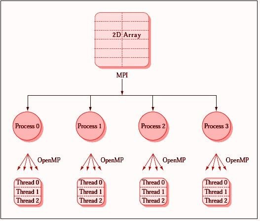

# Topic 

The Message Passing Interface (MPI)

## Report

In this report i'd like to research a little bit about the MPI and how it works with OpenMP together. MPI is a communication protocol and set of conventions for parallel programming. So it is very interesting for this course, as we use OpenMP for parallel programming. MPI can be used for applications where the data is distributed across threads. Sometimes parallel tasks in OpenMP need to exchange information, like the access modifiers `private`, `firstprivate` and so on. This is most of the time needed in scientific simulations or numerical computations, like our computation of pi from one of the first lectures.

So in conclusion, the advantage of using MPI with OpenMP is the creation of applications, which can scale across distributed as well as shared-memory architectures.

### Visualization

A good image of the MPI with OpenMP can be found [here](https://www.researchgate.net/figure/OpenMP-and-Message-Passing-Interface-MPI-Figure-1-explains-how-MPI-works-in-parallel_fig1_270791041):
